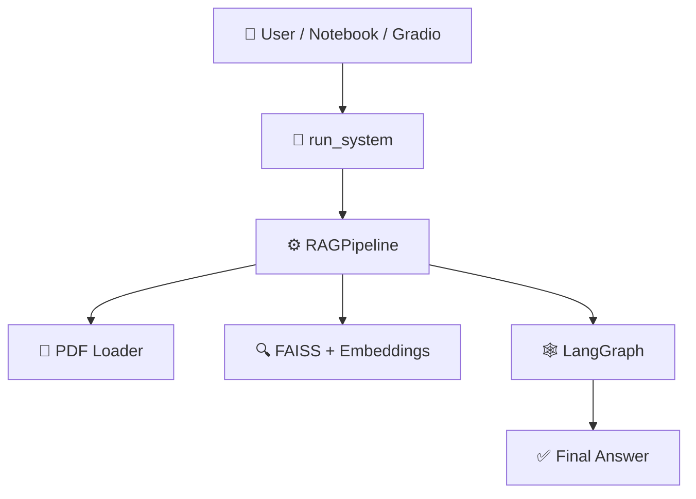

## 🤖 LangGraph RAG System

> A **fully local Retrieval-Augmented Generation (RAG) system** built with open-source tools, featuring clean architecture and production-grade design patterns.

This project evolved from a notebook prototype into a **modular, production-ready Python codebase** that demonstrates how real ML systems are architected and deployed.

---

## ✨ Features

🔹 **PDF Processing** – Takes any PDF URL as input  
🔹 **Smart Chunking** – Intelligent document parsing and segmentation  
🔹 **Vector Search** – FAISS-powered semantic retrieval  
🔹 **Local LLM** – 4-bit quantized Mistral 7B (runs on modest hardware)  
🔹 **Agent Orchestration** – LangGraph-powered workflow management  
🔹 **Context-Aware** – Answers strictly from document content  

---

## 🏗️ Architecture Overview


---

## 📂 Project Structure
```
langgraph-rag/
│
├── app/
│   ├── agents.py          # 🤝 Retrieval and answer agents
│   ├── loader.py          # 📄 PDF loading and chunking
│   ├── embeddings.py      # 🔍 Embeddings + FAISS (lazy-loaded)
│   ├── model.py           # 🧠 Local LLM loader (4-bit, lazy)
│   ├── pipeline.py        # ⚙️ Central orchestration layer
│   ├── runsystem.py       # 🎯 Public entry point
│   └── gradio_ui_app.py   # 🎨 Optional UI
│
├── demo_langgraph_rag.ipynb  # 📓 Demo notebook
├── requirements.txt          # 📦 Dependencies
└── README.md                 # 📖 Documentation
```

---

## 🛠️ Tech Stack

| Component | Technology |
|-----------|-----------|
| **Language** | Python 🐍 |
| **Orchestration** | LangGraph |
| **Framework** | LangChain |
| **Vector Store** | FAISS |
| **Embeddings** | SentenceTransformers |
| **LLM** | Mistral 7B (4-bit quantized) |
| **Quantization** | BitsAndBytes |
| **PDF Parser** | pdfplumber |
| **UI** | Gradio (optional) |
| **Version Control** | Git + GitHub |

---

## 🎯 Why This Project Stands Out

Most RAG demos live and die in notebooks. This project focuses on **real engineering principles**:

✅ **Modular Architecture** – Clean separation from notebook globals to production modules  
✅ **Memory Optimization** – 4-bit quantization for resource-constrained environments  
✅ **Performance** – Lazy loading to avoid slow cold starts  
✅ **Maintainability** – Centralized orchestration in `pipeline.py`  
✅ **Reproducibility** – Works seamlessly after `git clone`  

---

## 🚀 Quick Start

### Installation
```bash
# Clone the repository
git clone https://github.com/sahil-singhal-ai/langgraph-rag.git
cd langgraph-rag

# Install dependencies
pip install -r requirements.txt
```

### Usage
```python
from app.runsystem import run_system

# Define your inputs
pdf_url = "https://thedocs.worldbank.org/en/doc/8bf0b62ec6bcb886d97295ad930059e9-0050012025/original/GEP-June-2025.pdf"
question = "What is this document about? Answer in 200 words"

# Run the system
run_system(pdf_url, question)
```

---

## 📓 Demo Notebook

A clean, production-style demo notebook is included:

**`demo_langgraph_rag.ipynb`**

The notebook serves as a **thin client** – all business logic lives in Python modules, demonstrating proper separation of concerns.

---

## 💡 Key Design Decisions

🔸 **Lazy Loading** – Models and embeddings load on-demand to minimize startup time  
🔸 **4-bit Quantization** – Enables local LLM inference on consumer hardware  
🔸 **Stateless Pipeline** – Each run is independent, making the system scalable  
🔸 **Agent-Based Flow** – LangGraph manages retrieval → generation workflow  

---

## 🎓 Learning Outcomes

This project demonstrates:

- Moving from **prototype → production** code structure
- Handling **resource constraints** in ML systems
- Implementing **clean architecture** patterns in AI applications
- Building **reproducible, shareable** ML systems
- Real-world **RAG implementation** beyond toy examples

---

## 👨‍💻 Author

**Sahil Singhal**

Built with a focus on **real-world ML engineering challenges**, not just demos.

---

## 📝 License

Open source – feel free to learn, adapt, and build upon this work.

---


---

<div align="center">

**⭐ If you found this helpful, consider giving it a star!**
